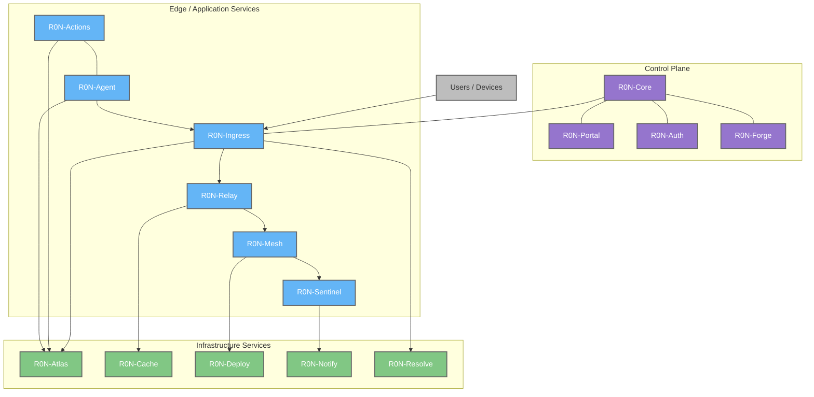

# R0N-Labs

## Overview

R0N-Labs is an open, modular infrastructure ecosystem focused on building scalable, high-performance systems for IoT, cloud, and distributed environments. The R0N philosophy is centered around **using the right tool for the job**: Rust acts as the orchestrator and control plane, while individual components may be implemented in the most suitable language for their specific workload.

The ecosystem is designed to be composable, extensible, and deployment-agnostic, supporting bare metal, virtual machines, containers, and optional Kubernetes integration.

## Design Philosophy

* **Modular by default** – Each component can be deployed, scaled, and upgraded independently.
* **Polyglot architecture** – Rust provides safety, performance, and orchestration; other languages are used where they make the most sense.
* **Infrastructure-first** – Designed for gateways, edge computing, IoT platforms, and backend systems.
* **Automation-driven** – Emphasis on workflows, policy-based routing, and automated lifecycle management.
* **Open and self-hostable** no enterprise licensing requirements.

## Architecture

## Products

| Service | Description | Status |
| ------- | ----------- | ------ |
| R0N-Ingress | High-performance edge and network gateway for protocol handling, routing, and policy enforcement. Acts as the primary entry point between devices, services, and backend systems. | WIP |
| R0N | Unified tool, plugin manager, and command-line interface for managing R0N modules, including lifecycle management, configuration, updates, and orchestration. | WIP |
| R0N-Atlas | A distributed data platform composed of multiple interconnected databases, each optimized for a specific purpose (e.g. time-series, authentication, caching, fast lookup). Acts as the system of record for the R0N ecosystem. | WIP |
| R0N-DNS | Programmable DNS service for dynamic environments, service discovery, and policy-based routing. | WIP |
| R0N-Actions | Workflow and automation engine enabling event-driven logic, task orchestration, and system-level automation across R0N components. | WIP |
| R0N-Framework | Shared framework providing common abstractions, APIs, and libraries for building R0N-compatible services and extensions. | WIP |
| R0N-Portal | Web-based management interface for monitoring, configuration, and control of R0N services, including a plugin marketplace. | WIP |
| R0N-Agent | Lightweight execution agent responsible for running tasks, plugins, and background jobs as part of workflows and gateway operations. | WIP |
| R0N-Relay | Messaging and event relay service for IoT and event-driven systems, responsible for reliable data delivery and routing between components. | WIP |
| R0N-Deploy | Deployment and over-the-air update service supporting staged rollouts, versioning, and rollback strategies for devices and services. | WIP |
| R0N-Mail | Mail service for transactional and system-level communications, integrated with workflows, alerts, and automation pipelines. | WIP |
| R0N-Flux | Caching and acceleration service designed to improve performance, reduce latency, and offload backend systems. | WIP |
| R0N-Veil | Secure application transport layer providing encrypted, policy-driven, and zero-trust-oriented service communication. | WIP |
| R0N-Forge | Git and development control plane for managing repositories, CI/CD workflows, policies, and developer automation within the R0N ecosystem. | WIP |
| R0N-Sentinel | Firewall and security enforcement service responsible for traffic filtering, threat detection, and policy-based access control. | WIP |
| R0N-Auth | Centralized authentication and authorization service providing identity management, token issuance, policy enforcement, and integration with other R0N components. | WIP |

## Status

Most components are currently under active development and marked as **Work In Progress (WIP)**. Interfaces, features, and implementations may change as the ecosystem evolves.

## Goals

* Provide a cohesive alternative to fragmented infrastructure stacks.
* Enable reliable self-hosted and edge-first deployments.
* Support large-scale IoT and distributed systems without vendor lock-in.

## License

All R0N-Labs projects are licensed under the **Apache License 2.0**, unless explicitly stated otherwise.
